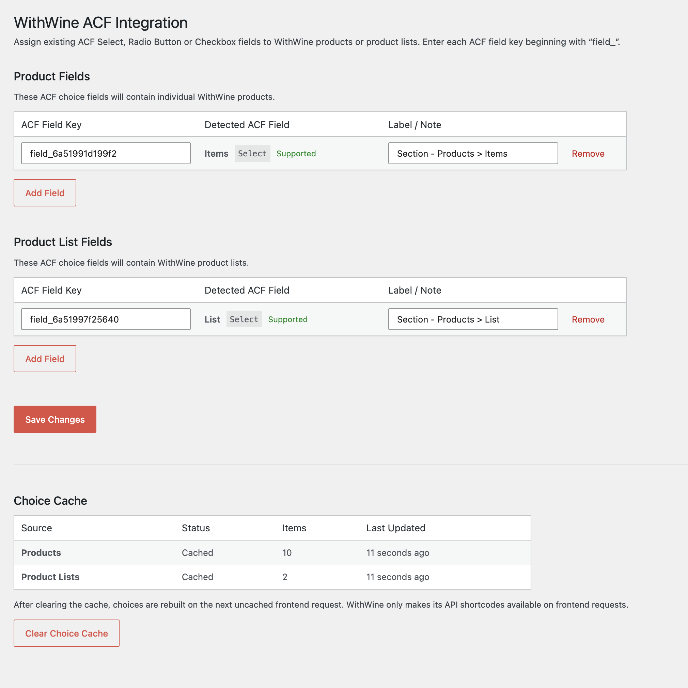
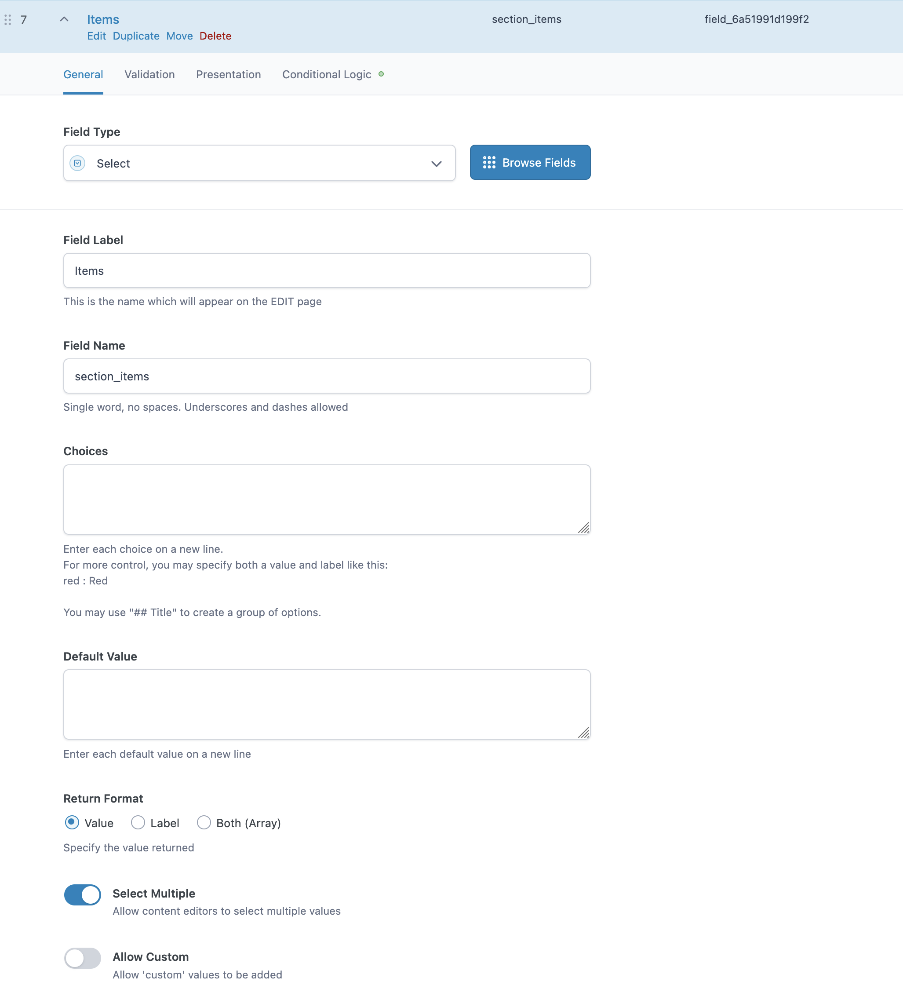
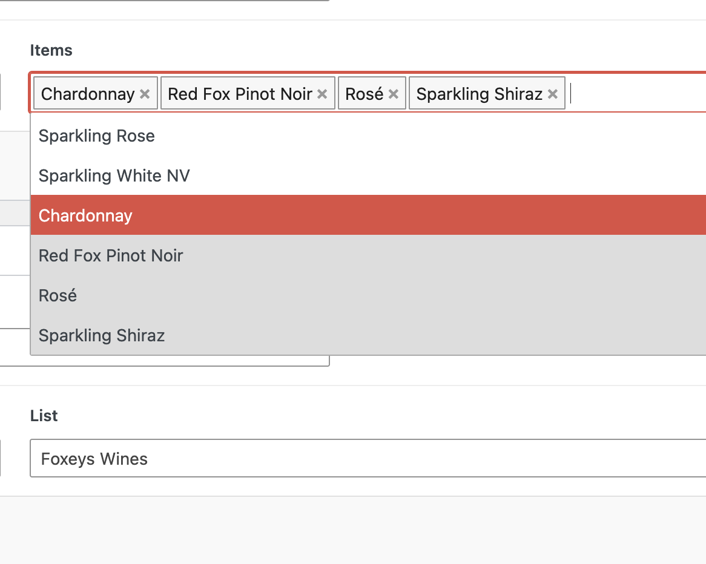

# WithWine ACF Integration

Automatically populate Advanced Custom Fields (ACF) Select, Radio Button and Checkbox fields with live Product and Product List data from the WithWine WordPress plugin.

Rather than introducing custom ACF field types, this plugin works with ACF's native choice fields, allowing you to continue using all of ACF's built-in functionality including multiple selection, Stylized UI (Select2), return formats, conditional logic and more.

[](https://github.com/benkanizay/withwine-acf-integration/releases)
[](license.txt)

---

## Features

- Populate native ACF **Select**, **Radio Button** and **Checkbox** fields with WithWine Products or Product Lists.
- No custom ACF field types required.
- Supports multiple selection, Stylized UI (Select2), return formats and conditional logic.
- Automatic transient caching for fast admin performance.
- Manual cache refresh from the plugin settings page.
- Automatically clears cached data when SiteGround Optimizer flushes the site cache (if installed).
- Displays the configured ACF field label and field type in the settings page.
- Warns when configured field keys cannot be found or belong to unsupported field types.
- Prevents duplicate field keys from being saved.

---

## Requirements

- WordPress
- Advanced Custom Fields (Free or Pro)
- The WithWine WordPress plugin

The plugin checks that both ACF and WithWine are active before loading.

---

## Installation

### Option 1 (Recommended)

1. Download the latest plugin ZIP from the repository's **Releases** page.
2. In WordPress, go to **Plugins → Add New Plugin → Upload Plugin**.
3. Upload the ZIP and activate **WithWine ACF Integration**.
4. Ensure both **Advanced Custom Fields** and **WithWine** are active.

### Option 2

Clone this repository directly into your site's `wp-content/plugins/` directory, then activate **WithWine ACF Integration**.

---

## Configuration

1. Create or edit an ACF **Select**, **Radio Button** or **Checkbox** field.
2. Copy the field's **Field Key** (for example `field_64abc123...`).
3. Navigate to **Settings → WithWine ACF**.
4. Add the field key under one of the following sections:
   - **Product Fields** — populates the field with individual WithWine Products.
   - **Product List Fields** — populates the field with WithWine Product Lists.
5. Optionally add a note describing where the field is used.
6. Save the settings.

The settings page displays the detected ACF field label and field type, making it easy to confirm you've configured the correct field.

---

## How It Works

WithWine registers its API shortcodes during frontend requests rather than normal WordPress admin requests.

This plugin therefore:

1. Retrieves Product and Product List data during a supported frontend request.
2. Stores the results using WordPress transients.
3. Uses the cached data whenever configured ACF fields are rendered in the WordPress admin.

This keeps the editor fast while avoiding unnecessary API requests.

---

## Caching

The default cache lifetime is **24 hours**.

The cache can be cleared at any time from:

**Settings → WithWine ACF → Clear Choice Cache**

The cache is also cleared automatically when:

- SiteGround Optimizer flushes the site cache (if installed).

The next frontend request automatically rebuilds the cache.

---

## Stored Values

The plugin stores the corresponding WithWine ID as the field value.

For example:

- Product field → Product ID
- Product List field → Product List ID

The value returned by `get_field()` depends on the ACF field's configured **Return Format**.

```php
$product = get_field( 'featured_product' );
```

Checkbox and multi-select fields return an array of selected values.

---

## Notes

- Duplicate field keys are automatically removed when settings are saved.
- Unsupported ACF field types are ignored.
- Existing field choices are left untouched if WithWine data cannot be retrieved.
- Notes stored beside field keys are for administration only and are never used by the plugin.

---

## Screenshots

### Plugin Settings

Configure which ACF choice fields should be populated with WithWine Products or Product Lists.



### ACF Field Configuration

Use any native ACF Select, Radio Button or Checkbox field.



### Populated Choice Field

Configured fields are automatically populated using cached WithWine data.



---

## Contributing

Issues, feature requests and pull requests are welcome.

---

## Disclaimer

This is an independent integration plugin and is not affiliated with or endorsed by WithWine or Advanced Custom Fields.

---

## License

This plugin is licensed under the GNU General Public License v2 or later (GPL-2.0-or-later).

See `license.txt` for the full license.

---

Created by **Ben Kanizay**

If you find this plugin useful, please consider ⭐ starring the repository.